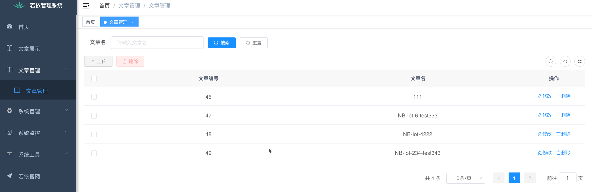

### 说明

* 实现的功能：对typora编写的md文档导出的html文章的每个章节单独进行权限控制且html文章显示效果和typora的md一致

* 本项目基于若依前后端分离版(vue + springboot)

* 使用到的非crud技术：正则 + 递归 + 单调栈(核心代码见`typoraHtml2treeJson_typora_v1.3.8.js`和后端代码)

* 本项目的代码写的非常随意(前后端代码都是用vim书写所以偷懒随意写)，是课余时间帮别人免费写的一个小demo，如果无法直视请见谅

### 使用方式

0. 部署本项目的前端和后端，并导入若依的sql文件和我的mysql.sql文件

1. typora编写md文章

2. typora导出md文章为html格式

3. 在本项目的文章管理页面上传html+images压缩后的xx.zip文件(xx.zip文件的格式见demo.zip和`文章图片问题`)

4. 文章展示中查看效果

### 效果

#### 文章管理

#### 文章主页

以`admin`账号登录，拥有所有权限：

#### 文章章节权限管理效果

以`visitor`账号登录，只拥有试看某些章节的权限：

### 文章图片问题

html中的文章的图片浏览器无法加载显示怎么办？

1. 请检查你删除的xx.zip文件内部是否有images文件夹

2. 请检查typora的图片是否是使用的相对路径，请设置为如图的样子：

